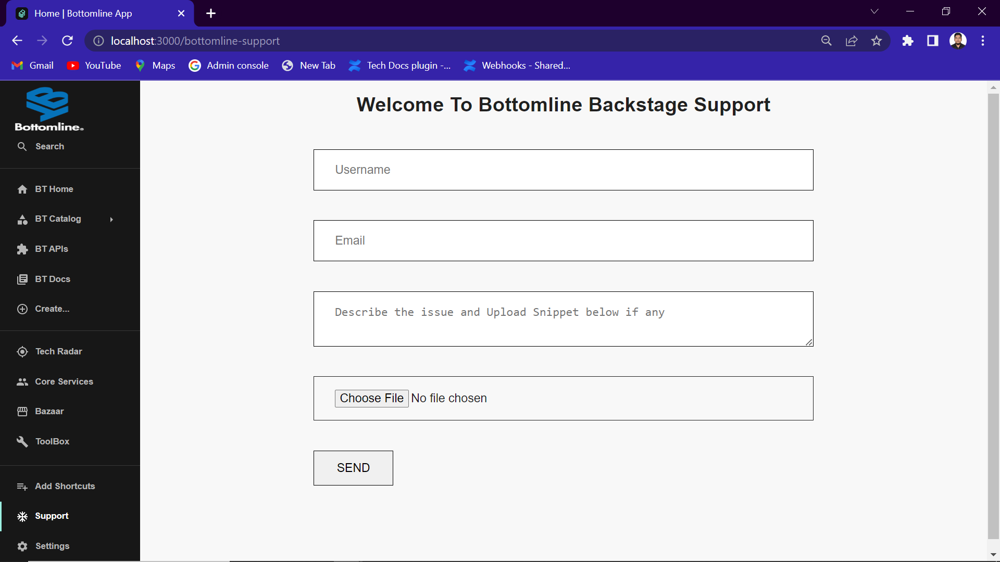

# Custom Plugin

An approach without using Backstage CLI commands.

To understand, let's take a look at the "Support" plugin as an example.

**Objective:** To create a plugin that allows a user to report an issue.

## Step 1: Create a .tsx File with the Core Plugin Logic

### `Main.tsx`

```tsx
import React from 'react';
import "./style.css";

const Contact = () => {
  return (
    <div className='wrapper'>
      <h2 className='common-heading'>Welcome To Bottomline Backstage Support</h2>
      <div className="container">
        <div className="contact-form">
          <form action="https://formspree.io/f/xayzklnz" method='POST' className='contact-inputs'>
            <input type="text" name="username" placeholder='username' autoComplete='off' required />
            <input type="text" name="Email" placeholder='Email' autoComplete='off' required />
            <textarea name="message" placeholder='Describe the issue and Upload Snippet below if any' autoComplete='off' required></textarea>
            <input type="file" name='upload' title='upload Snippet if any'/>
            <input type="submit" value="send"/>
          </form>
        </div>
      </div>
    </div>
  );
};

export default Contact;
```

## Step 2: Expose the Support Plugin

### `packages/app/src/App.tsx`

```tsx
import SupportCustomPlugin from './support-custom-plugin/main';

// ...

const AppRoutes = () => (
  <FlatRoutes>
    // ...
    <Route path="/bottomline-support" element={<SupportCustomPlugin/>}/> {/*Support Custom Plugin*/}
    // ...
  </FlatRoutes>
);
```

### Explanation

- `<Route>`: This is a component from React Router, a library used for routing in React applications. It defines a route that matches a specific path and renders a component when that path is accessed.
- `path="/bottomline-support"`: This attribute specifies the URL path that needs to be matched for this route to be activated. In this case, it's set to "/bottomline-support".
- `element={<SupportCustomPlugin/>}`: This attribute specifies the component to be rendered when the path is matched. The angle brackets `<>` are used to indicate that it's a JSX component.
- `{/*Support Custom Plugin*/}`: This is a comment within the JSX code.

To summarize, this line of code sets up a route that matches the URL path "/bottomline-support" and renders the `<SupportCustomPlugin/>` component when that path is accessed.

## Step 3: Add the Navigation in the Frontend

### `packages/app/src/components/Root/Root.tsx`

```tsx
import AcUnitOutlinedIcon from '@material-ui/icons/AcUnitOutlined';

// ...
export const Root = ({ children }: PropsWithChildren<{}>) => (
  <SidebarPage>
    // ...
    <SidebarItem icon={AcUnitOutlinedIcon} to="bottomline-support" text="Support"/>  {/* custom plugin */}
    // ...
  </SidebarPage>
);
```

## Output


This will add a new "Support" item in the sidebar navigation with an icon, which links to the custom support plugin page.

---

This Markdown file provides detailed steps and explanations on how to create and integrate a custom plugin into a Backstage application without using Backstage CLI commands.